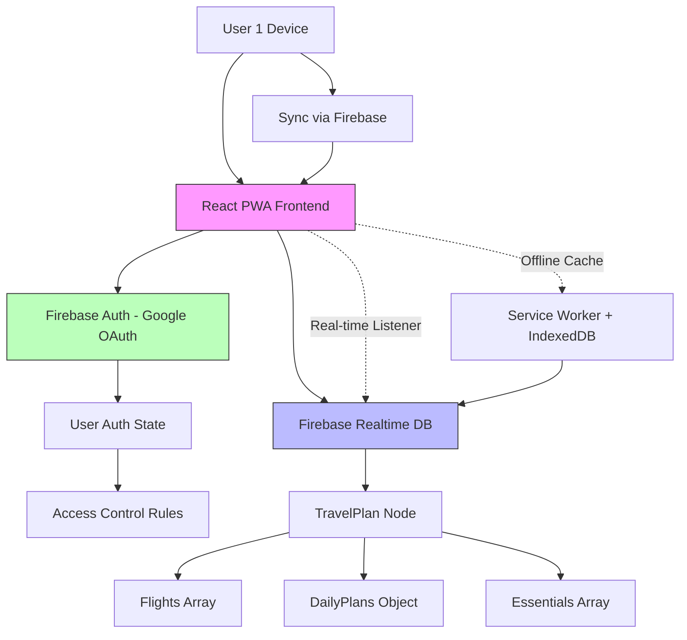

# Travel Planner PWA: Architecture Plan for Multi-User Sync with Google OAuth

## Overview

The existing app is a React-based Progressive Web App (PWA) for travel planning, featuring tabs for date setting, flight tickets, daily plans, and essentials. It uses local state management and date-fns for calculations. To add multi-user support (exactly 2 users sharing one travel plan) with real-time syncing, we'll integrate Google OAuth for authentication and Firebase for backend storage and real-time database syncing. This leverages free tiers: Google OAuth via Firebase Auth (free for basic usage) and Firebase Realtime Database/Firestore (free Spark plan with limits suitable for small-scale apps).

Key goals:

- Secure login with Google accounts.
- Shared travel plans between exactly 2 users (e.g., a couple).
- Real-time syncing of flights, daily plans, and essentials across users.
- Offline support via PWA service worker, with sync on reconnection.

## 1. Authentication System Design (Google OAuth - Free Tier)

### Approach

Use Firebase Authentication with Google provider. Firebase Auth is free for up to 10,000 monthly active users (plenty for this scope). No custom backend server needed.

### Steps for Integration

1. **Setup Firebase Project**:

   - Create a free Firebase project at console.firebase.google.com.
   - Enable Google Authentication in the Authentication > Sign-in method section.
   - Add web app to the project and get config (apiKey, authDomain, etc.).

2. **Frontend Integration (React)**:

   - Install Firebase SDK: `npm install firebase`.
   - Initialize Firebase in `src/firebase.js` with the config.
   - Use `signInWithPopup` or `signInWithRedirect` from `firebase/auth` for Google sign-in.
   - Store user state (UID, email, displayName) in React context or Redux for app-wide access.

3. **User Flow**:

   - On app load, check auth state with `onAuthStateChanged`.
   - If not logged in, show login button/modal with Google sign-in.
   - Post-login: Fetch/create travel plan associated with the user's UID.
   - For sharing: Owner generates a share link/code; second user joins via Google login and accepts invite (stored in DB).

4. **Security**:

   - Use Firebase Security Rules to restrict access: Only authenticated users can read/write their plans.
   - For shared plans: Rules check if user's UID is in the plan's `users` array (max 2).

5. **Free Tier Limits**:
   - Auth: Unlimited sign-ins, but monitor for 10k MAU.
   - No cost for basic OAuth flows.

### Code Snippet Example (in App.js or Auth component)

```javascript
import { GoogleAuthProvider, signInWithPopup, signOut } from "firebase/auth";
import { auth } from "./firebase";

const provider = new GoogleAuthProvider();
const signIn = () => signInWithPopup(auth, provider);
const signOutUser = () => signOut(auth);
```

## 2. Backend Architecture Outline

- **Service**: Firebase Realtime Database (for real-time sync) or Firestore (more scalable, both free tiers available).
- **Why Firebase?**: Handles real-time updates out-of-the-box, integrates with Auth, supports offline persistence.
- **Structure**:
  - Plans stored under `/travelPlans/{planId}`.
  - Real-time listeners on plan nodes for live updates.
- **Offline Sync**: Use Firebase SDK's offline capabilities + PWA service worker for caching UI state.

## 3. Data Models

- **TravelPlan**:
  ```json
  {
    "planId": "unique_id",
    "ownerUid": "user_uid_1",
    "users": ["user_uid_1", "user_uid_2"], // Exactly 2 max
    "startDate": "2025-10-01",
    "endDate": "2025-10-05",
    "totalDays": 5,
    "flights": [
      {
        "id": "flight_1",
        "airline": "China Airlines",
        "departure": "2025-10-01 08:00",
        "arrival": "2025-10-01 12:00",
        "price": "$500",
        "comment": "Window seat preferred"
      }
    ],
    "dailyPlans": {
      "Day 1": "Visit Eiffel Tower",
      "Day 2": "Louvre Museum"
    },
    "essentials": ["Passport", "Adapter"],
    "createdAt": timestamp,
    "updatedAt": timestamp
  }
  ```
- **Invites** (for joining): `/invites/{inviteCode}` with `planId` and `status`.

## 4. UI/UX Updates

- **New Components**:
  - LoginModal: Google sign-in button.
  - ShareButton: Generate invite code/link for second user.
  - UserIndicator: Show current user and partner status.
  - Real-time indicators (e.g., "Partner updated flight").
- **Tab Modifications**:
  - Add "Share Plan" in header.
  - Conflict resolution for edits (last-write-wins or notifications).
- **Offline Handling**: Show cached data, sync icon when reconnecting.

## 5. System Architecture Diagram



## Implementation Phases

See todo list for step-by-step execution.

This plan ensures scalability within free tiers while providing seamless real-time collaboration.
